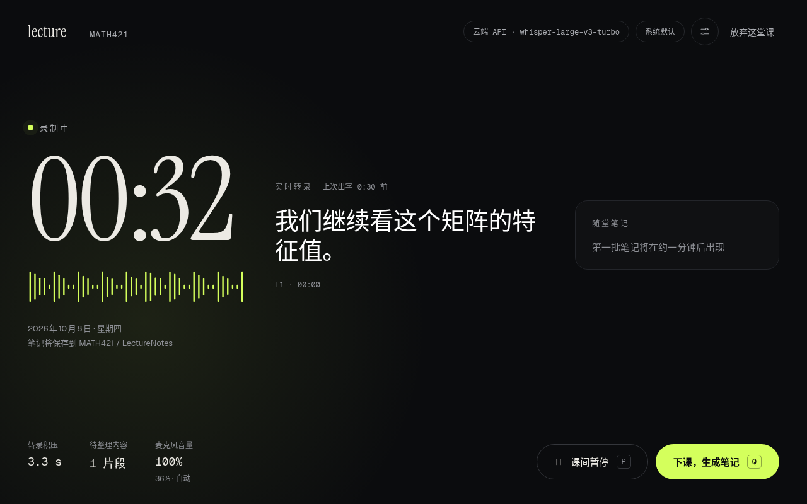

# Lecture CLI

把课堂录音实时转成文字，下课后自动整理成中文课堂笔记，存成 Markdown，可以在自带的界面或 Obsidian 里阅读。



## 需要什么

- Linux（x86_64）和 [uv](https://docs.astral.sh/uv/)。
- FFmpeg 和 PortAudio：Arch 装 `uv ffmpeg portaudio`，Debian/Ubuntu 装 `ffmpeg libportaudio2`。
- 中文字体 Noto CJK：Arch 装 `noto-fonts-cjk`，Debian/Ubuntu 装 `fonts-noto-cjk`。
- 有 NVIDIA 显卡可以在本机转录；没有显卡就用云端转录。

## 安装

```sh
git clone https://github.com/ZChenW/lecture-cli.git && cd lecture-cli
./install.sh
lecture gui
```

`./install.sh` 会根据有没有显卡建议一个档位，按回车确认，或输入另一个：

- `api`：没有显卡或电脑较旧，用云端转录，只装基础依赖。
- `cpu`：在本机 CPU 上转录。
- `gpu`：有 NVIDIA 显卡，本机转录更快，还能用 Qwen 转录中文。

也可以直接写明档位，例如 `./install.sh --profile api`。其他选项见[安装细节](docs/reference.md#安装细节)。卸载运行 `./uninstall.sh`，配置、key 和笔记都会保留。

## 第一次使用

运行 `lecture gui`，按提示选课程目录（里面的每个文件夹是一门课）、选转录方式、填笔记服务的 key（默认 DeepSeek）。最后一步检查环境，哪里有问题会指出该回到哪一步。这些以后都可以在设置里改。

## 日常使用

- **开始上课**：首页选课程，点“开始上课”。
- **课间暂停**：点“课间暂停”或按 P，暂停期间不录音。
- **下课**：点“下课，生成笔记”或按 Q，笔记在后台整理，关掉窗口也不会中断。
- **看笔记**：首页点开课程下的任意一节笔记。
- **待核对**：听不清或收音弱的地方会被标出来，在笔记的“待核对”里对照课件确认后打勾。

麦克风音量会自动调节，不需要手动设置。

## 命令行

```sh
lecture courses                                        # 列出课程
lecture start MATH421                                  # 在终端里录一堂 MATH421，P 暂停，Q 下课
lecture start MATH421 --audio-file lecture.m4a --fast  # 把已有的录音整理成笔记
lecture doctor                                         # 检查环境和服务，不录音
lecture doctor --mic-test                              # 听几秒背景声，检查麦克风
lecture --help                                         # 全部命令
```

## 笔记保存在哪

```text
<课程目录>/MATH421/LectureNotes/
├── 2026-09-14_143000-课堂笔记-a1b2c3.md
└── 原文与记录/
    ├── 2026-09-14_143000-课堂笔记-a1b2c3.transcript.md
    ├── 2026-09-14_143000-课堂笔记-a1b2c3.live.md
    └── 2026-09-14_143000-课堂笔记-a1b2c3.review.md
```

`LectureNotes/` 下的 `.md` 就是课堂笔记。`原文与记录/` 里是附件：完整转录（`.transcript.md`）、随堂记录（`.live.md`）和待核对清单（`.review.md`）。这些文件会被程序重写，自己的补充请写在别的文件里。录音不长期保存。

## 数据会发到哪里

- 课堂文字会发送到笔记服务（默认 DeepSeek），消耗它的额度。
- 选了云端转录或云端课后校正时，课堂音频会上传到转录服务。
- key 只存在本机的配置目录里，只有你自己能读。

## 出问题时

先运行检查，每一项失败都会给出修复建议：

```sh
lecture doctor
```

- **录不到声音**：运行 `lecture doctor --mic-test`，它会告诉你麦克风正常、音量过高还是没有在工作。还是不行，按[录不到声音怎么查](docs/reference.md#录不到声音怎么查)逐项检查系统设置和硬件开关。
- **转录不准**：中文课改用本机 Qwen 转录（需要 NVIDIA 显卡，见 [Qwen 语音识别](docs/reference.md#qwen-语音识别)）；让麦克风离讲话人近一些，或者换外接麦克风。
- **没有显卡**：用 `./install.sh --profile api` 安装，在设置里把转录方式选成云端 API。
- **找不到 `lecture` 命令**：确认 `~/.local/bin` 在 `PATH` 里，然后打开新终端。

更多问题见[故障排查](docs/reference.md#故障排查)。

## 更多

配置项、更换服务、各功能的详细规则、ASR 对比诊断、zsh 补全和开发说明都在 [docs/reference.md](docs/reference.md)。
